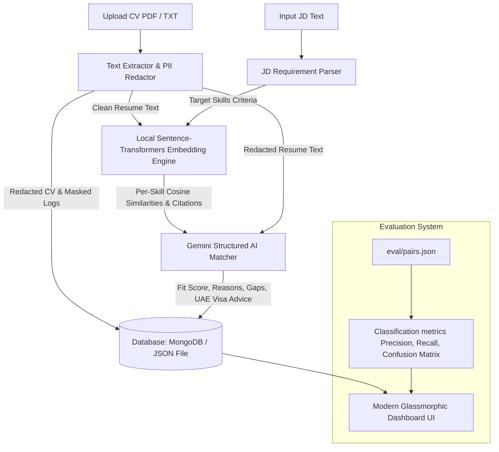

# AI CV-to-JD Matcher (UAE Recruiting Suite)

A production-ready, full-stack Next.js web application designed to help HR departments parse CVs, redact sensitive personally identifiable information (PII) according to compliance regulations, match qualifications against Job Descriptions (JDs), and analyze fit using offline sentence embeddings and Gemini AI structured reasoning.

Designed to execute **100% on localhost** with zero paid service dependencies.

---

## 🏗️ System Architecture

The following diagram illustrates the flow of data through the parsing, redaction, embedding comparison, and evaluation layers:



---

## ⚡ Main Features

1. **HR Recruiter Dashboard UI**: A modern, glassmorphic layout supporting dark and light modes. Features radial match score indicators, high-impact recommendation badges (Hire / Borderline / Reject), and citation references showing where candidate qualifications matched the JD.
2. **Automated PII Redaction**: Searches and filters out sensitive variables like **Emirates ID numbers**, **passport numbers**, and **Dates of Birth (DOB)**, alongside standard emails and phone numbers. It saves redacted CVs in the database and features a side-by-side **PII Redaction Visualizer** in the audit log to review the filtration.
3. **Local Embedding Similarity Engine**: Computes sentence embeddings offline using `@xenova/transformers` (running the `all-MiniLM-L6-v2` model in Node.js CPU/GPU threads) to compare CV chunks against requirements. Generates similarity scores and locates specific resume quotes as semantic citations.
4. **Structured Gemini Reasoning**: Integrates the Gemini API with strict JSON schema definitions to return fit parameters, gap analyses, and seniority matches.
5. **UAE Work Regulations Compliance**: Automatically detects UAE-specific work statuses (Employment Visa, Dependent Visa, Golden Visa) and advises on residency sponsorship requirements.
6. **SKLearn-Style Evaluation Framework**: Features a validation dashboard loaded with 20 pre-configured candidate-JD pairs. Computes and graphs **Accuracy**, **Precision**, **Recall**, **F1 Score**, and a **2x2 Confusion Matrix** using recharts.

---

## 🧠 Local Semantic Matching Pipeline

The system incorporates a fully local, offline semantic matching pipeline using HuggingFace sentence-transformers.

### 1. HuggingFace Sentence-Transformers
We utilize the popular **`all-MiniLM-L6-v2`** model, which is a lightweight yet powerful sentence-transformer model that maps sentences and paragraphs to a 384-dimensional dense vector space. This model is ideal for CPU-only inference on a developer's local machine, providing fast and accurate semantic vector representations.

### 2. Local Embeddings Generation
- **Engine**: Running via **`@xenova/transformers`** (a native JavaScript port of HuggingFace's Transformers library), the model compiles entirely in Node.js and executes locally.
- **Caching**: The model files are cached inside the `./.cache/transformers` directory in your workspace on first run to ensure the application works 100% offline.
- **Inference**: High-dimensional text embeddings are computed locally using mean-pooling and normalized vector outputs.

### 3. Semantic Matching Pipeline
1. **CV Chunking**: The parsed CV text is split into semantic paragraphs/sentences (chunks) filtering out short noise.
2. **Vector Computation**: Local embeddings are generated for both the CV chunks and the Job Description text/individual skills.
3. **Cosine Similarity**: The mathematical similarity between vectors is calculated using the **`compute-cosine-similarity`** package.
4. **Skill Scoring**: We determine semantic competency by matching each skill requirement against the best matching CV chunk.
5. **Relevance Aggregation**: The overall semantic relevance score and confidence metric are computed dynamically, measuring contextual similarity rather than simple keyword overlap.

---

## ⚙️ Environment Variables

Create a `.env.local` file at the root of the project with the following configuration:

```env
# Database Configuration (Connects to local MongoDB, falls back to JSON file database if offline)
MONGODB_URI=mongodb://127.0.0.1:27017/ai_cv_jd_matcher

# Gemini API Key (Enter a free Gemini API Key or configure it directly in the UI drawer)
GEMINI_API_KEY=your_gemini_api_key_here

# Embedding Configuration (local = offline node model, hf = HuggingFace Inference API)
EMBEDDING_PROVIDER=local

# HuggingFace API Token (Optional, only needed if EMBEDDING_PROVIDER=hf)
HF_API_KEY=your_hugging_face_token_here
```

---

## 🚀 Local Setup & Execution

### 1. Prerequisite Installations
- Ensure [Node.js](https://nodejs.org/) (version 18+ or 22+ recommended) is installed.
- Ensure [MongoDB Community Server](https://www.mongodb.com/try/download/community) is installed and running on port 27017 (Optional: The application automatically falls back to a persistent JSON-file database at `eval/local_db.json` if MongoDB is offline!).

### 2. Install Packages
Navigate to the root directory and install dependencies:
```bash
npm install
```

### 3. Generate Mock Data & Seed Database
This compiles the 20 mock resumes (PDF format) and JDs, runs the matching predictions locally, writes them to the database, and prepares the evaluation system mapping:
```bash
node scripts/generate-data.js
node scripts/seed.js
```

### 4. Launch Development Server
```bash
npm run dev
```
Open your browser and navigate to [http://localhost:3000](http://localhost:3000).

---

## 📊 Evaluation & Verification

To verify the matching capabilities of the application:
1. Open the web interface and click on the **Evaluation Hub** tab.
2. Review the computed Accuracy, Precision, Recall, and F1 metrics.
3. Review the **Confusion Matrix** diagram showing the True Positives, False Negatives, False Positives, and True Negatives.
4. Filter and review the comparative table of the 20 pre-configured test pairs.
5. Re-run or reset the validation dataset by clicking the **"Re-seed & Evaluate Dataset"** button on the UI.

---

## 🔮 "What I Would Do With More Time"

If given additional time to scale the application:
1. **Parallel Web Workers**: Offload the local sentence embedding computations from the Next.js API server threads to client-side Web Workers (or background GPU worker threads) to handle batch uploads of 100+ CVs concurrently.
2. **OCR Integration**: Integrate a WebAssembly-based optical character recognition (OCR) engine (such as Tesseract.js) to parse scanned PDF resumes or image snapshots in addition to standard text-based PDFs.
3. **UAE Labor Law Chatbot**: Embed a RAG (Retrieval-Augmented Generation) chatbot trained on official UAE Ministry of Human Resources and Emiratisation (MOHRE) regulatory documents to advise recruiters on complex labor law compliance queries directly on the matching screen.
4. **Vector Database Indexes**: Integrate a local vector database index (such as Milvus or ChromaDB running in a local Docker container) to manage semantic search lookups across thousands of resume candidates.
